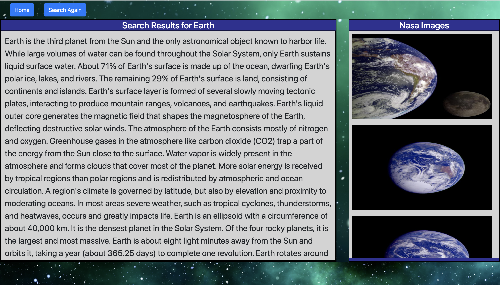
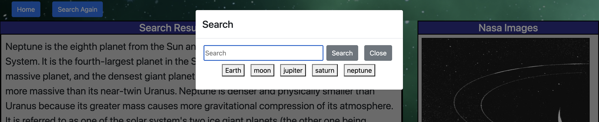

# SpaceEncyclopedia

## Description

\
User Story
```
AS AN user, I want a condensed search engine to look up different
facts and pictures of space.  I want the best quality images returned
from NASA's image database.  I want a short list of previous searches 
I made so I can reference them again.  I want a good looking UI.
```

## Screenshots




# Technologies Used
- HTML
- CSS/Bulma
- Javascript
- Wikipedia API
- NASA API

# Future Directions 
- Implement YouTube API
- Filter out non space related Wikipedia searches
- Add a "Read More" for the Wikipedia article
- Create clickable links for NASA images
- Add effects for every search
- Ability to create a collage of images on a seperate page

# Links
<a href="https://humzashaukat.github.io/SpaceEncyclopedia/index.html"
target="_blank">Deployed Link</a>

<a href="https://github.com/HumzaShaukat/SpaceEncyclopedia"
target="_blank">Github Repo</a>

